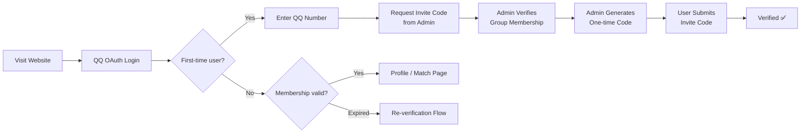
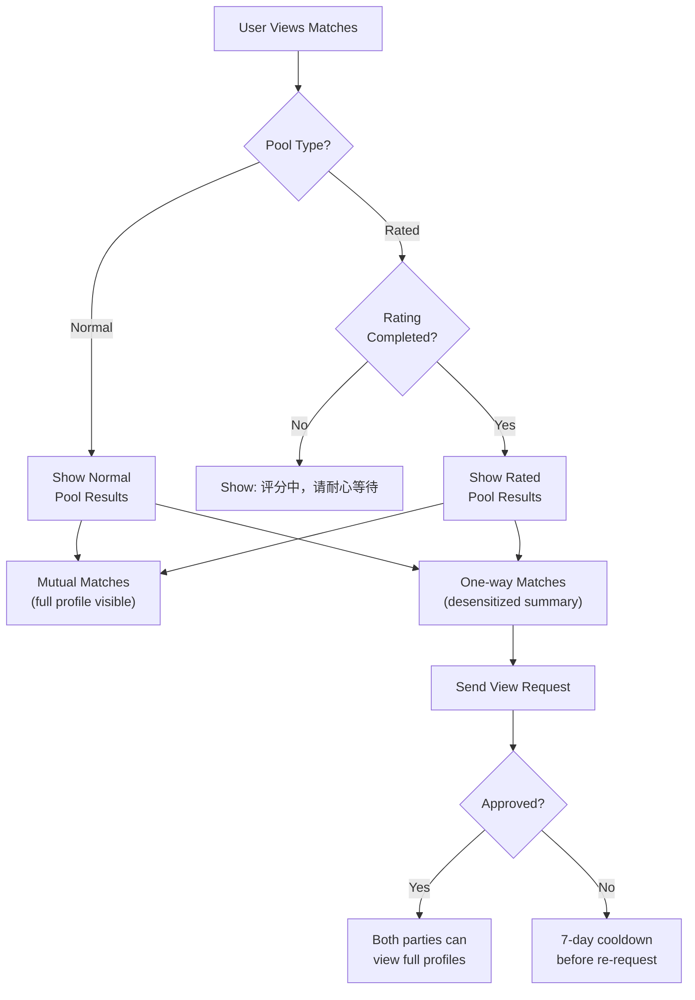
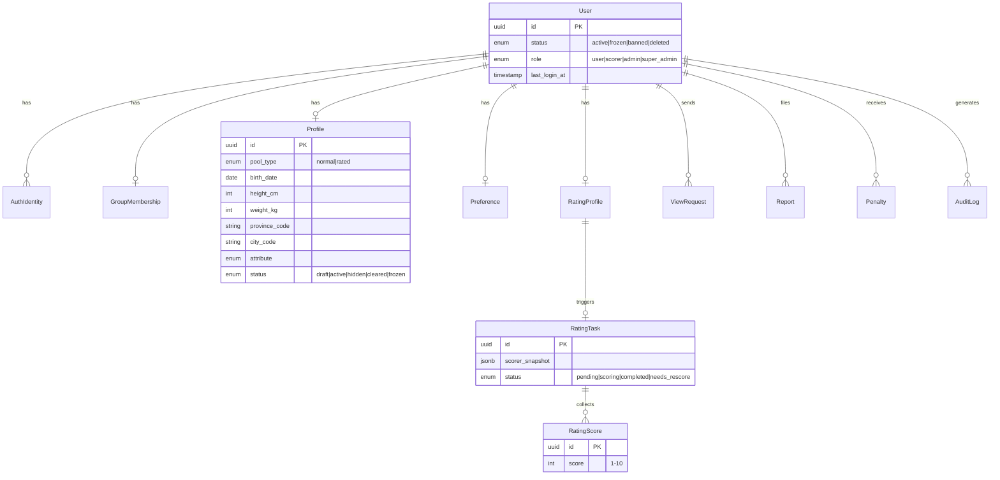

# Date System — Product Requirements Document (PRD)

**Version**: 1.0  
**Date**: 2026-05-27  
**Source Documents**: [CLIENT_BRIEF.md] · [PROJECT_SPEC.md]
**Status**: Draft — Awaiting Review

---

## 1. Product Vision & Problem Statement

### 1.1 One-Line Summary

**Date System** is a web-based profile matching platform exclusively for verified members of a designated QQ group, enabling automated bi-directional matching based on personal attributes and preferences.

### 1.2 Problems Solved

| Problem | How The System Addresses It |
|---|---|
| Scattered member info in QQ chat | Structured online profiles with standardized fields |
| Inefficient manual matching by admins | Automated matching engine with configurable criteria |
| Hard to verify ongoing group membership | Invite-code authentication with 30-day periodic re-verification |
| No mechanism for reporting fake profiles | Built-in report, warning, freeze, and ban workflow |
| Privacy risks with appearance scoring | Anonymous scorer panel; photos never shown to regular users |

### 1.3 Target Users

- **Age**: 18+ (hard enforcement)
- **Identity**: Must hold a QQ account
- **Membership**: Must be a verified member of the designated QQ group
- **Consent**: Must agree to profile-visibility terms before participating

---

## 2. User Roles & Permissions

### 2.1 Role Matrix

| Capability | Regular User | Scorer | Admin | Super Admin |
|---|:---:|:---:|:---:|:---:|
| QQ OAuth login | ✅ | ✅ | ✅ | ✅ |
| Submit / edit / clear own profile | ✅ | — | — | — |
| View mutual match full profiles | ✅ | — | — | — |
| Send / respond to view requests | ✅ | — | — | — |
| Report other users | ✅ | — | — | — |
| Score photos anonymously | — | ✅ | — | — |
| View scorer task queue | — | ✅ | — | — |
| Generate invite codes | — | — | ✅ | ✅ |
| Manage group memberships | — | — | ✅ | ✅ |
| Handle reports & penalties | — | — | ✅ | ✅ |
| Manage system config & roles | — | — | — | ✅ |
| Manage scorer panel members | — | — | — | ✅ |
| Trigger re-scoring | — | — | — | ✅ |
| View full audit logs | — | — | Read-only | ✅ |

### 2.2 Scorer Anonymity Constraints

> [!IMPORTANT]
> Scorers can **only** see the photo. They must **never** see: user ID, nickname, QQ number, age, location, attributes, preferences, or any other profile data. Rating task IDs must not be reverse-mappable to users.

---

## 3. Core User Flows

### 3.1 Authentication & Onboarding



**Membership States**: `pending` → `verified` → `expired` → re-verify → `verified` | `rejected` | `revoked`

### 3.2 Profile Submission

1. Fill in personal info (DOB, height, weight, city, attribute, QQ number)
2. Fill in preference criteria (age range, height range, weight range, expected location, expected attributes)
3. Choose participation mode: **Normal Pool** or **Rated Pool**
4. If Rated Pool → upload real photo
5. Accept visibility consent checkbox
6. Submit

### 3.3 Matching Flow



---

## 4. Functional Requirements

### FR-1: Authentication

| ID | Requirement | Priority |
|---|---|---|
| FR-1.1 | QQ OAuth 2.0 login (Authorization Code Flow) | **P0** |
| FR-1.2 | Store provider, openid, nickname, avatar per user | **P0** |
| FR-1.3 | Support future provider switch (QQ Connect → aggregator → custom gateway) | **P1** |
| FR-1.4 | Validate OAuth `state` parameter to prevent CSRF | **P0** |

### FR-2: Group Membership Verification

| ID | Requirement | Priority |
|---|---|---|
| FR-2.1 | Admin-generated one-time invite codes (hash-stored, 24hr default expiry) | **P0** |
| FR-2.2 | Invite code binds to a single QQ number | **P0** |
| FR-2.3 | Membership expires after 30 days; 7-day advance reminder | **P0** |
| FR-2.4 | Post-expiry: user retains profile but cannot view matches | **P0** |
| FR-2.5 | Grace period; after which profile is frozen | **P1** |
| FR-2.6 | Invite code generate / use / revoke events → audit log | **P0** |

### FR-3: User Profile

| ID | Requirement | Priority |
|---|---|---|
| FR-3.1 | Required fields: DOB, height (cm), weight (kg), city (province+city), attribute, QQ number | **P0** |
| FR-3.2 | Required preferences: age range, height range, weight range, expected location, expected attributes | **P0** |
| FR-3.3 | Optional: self-introduction (length-limited) | **P1** |
| FR-3.4 | Age auto-computed from DOB; must be ≥ 18 | **P0** |
| FR-3.5 | Consent checkbox required before submission | **P0** |
| FR-3.6 | Clear profile requires typing `确认清空我的资料` | **P0** |
| FR-3.7 | Cleared profiles removed from matching; account/auth/audit records preserved | **P0** |
| FR-3.8 | Draft save support | **P1** |

**Attribute Enum**: `1`, `0`, `偏1`, `偏0`, `side`, `其他`

### FR-4: Matching Engine

| ID | Requirement | Priority |
|---|---|---|
| FR-4.1 | Two isolated pools: `normal_pool` and `rated_pool` — never cross-match | **P0** |
| FR-4.2 | Mutual match = both A→B and B→A criteria met | **P0** |
| FR-4.3 | One-way match = only one direction met | **P0** |
| FR-4.4 | Matching criteria: age, height, weight, location, attribute, account/profile status, pool, rating status, 7-point rule | **P0** |
| FR-4.5 | Location matching: exact city / same province / unrestricted | **P0** |
| FR-4.6 | Attribute matching: explicit multi-select, no implicit inference | **P0** |
| FR-4.7 | MVP: real-time computation; snapshot caching deferred to later | **P1** |

**Sorting heuristics (V1)**: Mutual > One-way → Same city → Same province → Closer to preference midpoint (age/height/weight) → Profile completeness → Recent activity

### FR-5: Rating System (Appearance Scoring)

| ID | Requirement | Priority |
|---|---|---|
| FR-5.1 | Users in rated pool upload real photo | **P0** |
| FR-5.2 | Photo stored in private bucket; accessed via signed URL only by scorer panel | **P0** |
| FR-5.3 | System creates rating task; all scorer panel members must score | **P0** |
| FR-5.4 | Score range: integer 1–10 | **P0** |
| FR-5.5 | Final score: drop highest + lowest, average remainder → 1 decimal place | **P0** |
| FR-5.6 | Minimum 3 scorers per task | **P0** |
| FR-5.7 | Scorer snapshot frozen at task creation (roster changes don't affect in-flight tasks) | **P0** |
| FR-5.8 | Rating states: `not_submitted` → `pending` → `scoring` → `completed` (or `needs_rescore` / `withdrawn`) | **P0** |

### FR-6: 7-Point Threshold Rule

| ID | Requirement | Priority |
|---|---|---|
| FR-6.1 | Single fixed threshold at 7.0 — no user-defined score filters | **P0** |
| FR-6.2 | Users scoring ≥ 7 may choose `不限` (match anyone) or `仅7分及以上` (match only ≥ 7) | **P0** |
| FR-6.3 | Users scoring < 7 participate normally with no restriction option | **P0** |
| FR-6.4 | Rule applies to both mutual and one-way matches | **P0** |

### FR-7: Profile Visibility

| ID | Requirement | Priority |
|---|---|---|
| FR-7.1 | Unmatched users: no profile access | **P0** |
| FR-7.2 | Mutual match: full profile visible (excluding photo) | **P0** |
| FR-7.3 | One-way match: desensitized summary only (age range, province, height range, attribute) | **P0** |
| FR-7.4 | One-way view request → target approves → **both** parties see each other's full profile | **P0** |
| FR-7.5 | Rejection triggers 7-day cooldown before re-request | **P0** |
| FR-7.6 | Photos **never** displayed to regular users, **never** in leaderboard, **never** in match details | **P0** |

### FR-8: Reporting & Moderation

| ID | Requirement | Priority |
|---|---|---|
| FR-8.1 | Report types: fake info, stolen photo, impersonation, harassment, scam/spam, malicious behavior, other | **P0** |
| FR-8.2 | Reports include description + optional evidence screenshots | **P0** |
| FR-8.3 | Admin actions: warn, freeze profile, ban account | **P0** |
| FR-8.4 | Frozen/banned users excluded from match results | **P0** |
| FR-8.5 | Malicious reporters can also be penalized | **P1** |

### FR-9: Admin Dashboard

| ID | Requirement | Priority |
|---|---|---|
| FR-9.1 | Dashboard stats: total users, verified, pending, scoring-in-progress, pending reports, daily new users, daily matches | **P0** |
| FR-9.2 | User management: search, filter, view, warn/freeze/ban/unban | **P0** |
| FR-9.3 | Invite code management: generate, assign QQ, set expiry, revoke, view status | **P0** |
| FR-9.4 | Membership management: approve, reject, revoke, batch expire, add notes | **P0** |
| FR-9.5 | Report management: view, review, resolve, penalty execution | **P0** |
| FR-9.6 | Rating management (super admin): manage scorer roster, view task status, trigger rescore | **P0** |
| FR-9.7 | Audit log: all critical operations logged with actor, action, target, IP, timestamp | **P0** |

---

## 5. Non-Functional Requirements

### NFR-1: Security

| ID | Requirement |
|---|---|
| NFR-1.1 | Secure session management (HttpOnly, Secure, SameSite cookies) |
| NFR-1.2 | RBAC enforcement on every API endpoint |
| NFR-1.3 | OAuth Authorization Code Flow with `state` validation |
| NFR-1.4 | Invite codes stored as hashes, never plaintext |
| NFR-1.5 | Photos in private storage bucket; no public URLs |
| NFR-1.6 | Signed URLs with short TTL for scorer photo access |
| NFR-1.7 | Upload restrictions: file type (jpg/png/webp), size limit, generated filenames |
| NFR-1.8 | Rate limiting on: login, invite submission, view requests, reports, uploads |
| NFR-1.9 | Admin dangerous operations require secondary confirmation |

### NFR-2: Privacy & Compliance

| ID | Requirement |
|---|---|
| NFR-2.1 | QQ number, weight, location, photos classified as sensitive data |
| NFR-2.2 | Admin backend follows least-privilege display |
| NFR-2.3 | Audit trail for admin views of sensitive data |
| NFR-2.4 | User data deletion mechanism (profile clearing) |
| NFR-2.5 | User agreement, privacy policy, appeal mechanism required before launch |

### NFR-3: Performance & UX

| ID | Requirement |
|---|---|
| NFR-3.1 | Mobile-first design for user-facing pages (QQ in-app browser) |
| NFR-3.2 | Desktop-first for admin dashboard |
| NFR-3.3 | Scroll/wheel selectors for DOB, height, weight inputs |
| NFR-3.4 | Province-city cascading selector for location |
| NFR-3.5 | Match card layout optimized for quick mobile scanning |

---

## 6. Data Model Summary



> [!NOTE]
> Full field definitions for all 14 models (User, AuthIdentity, GroupMembership, InviteCode, Profile, Preference, RatingProfile, RatingTask, RatingScore, MatchSnapshot, ViewRequest, Report, Penalty, AuditLog) are documented in [PROJECT_SPEC.md §12](file:///c:/Users/46343/Documents/date-system/docs/PROJECT_SPEC.md#L858-L1109).

---

## 7. API Surface (Summary)

| Domain | Endpoints | Count |
|---|---|---|
| **Auth** | `/api/auth/qq/start`, `/callback`, `/logout`, `/me` | 4 |
| **Membership** | `/api/membership/status`, `/submit-code`, admin CRUD | 7 |
| **Profile** | `/api/profile/me` (GET/PUT), `/clear`, `/switch-pool` | 4 |
| **Rating** | `/api/rating/photo`, `/status`, scorer tasks, admin rescore | 6 |
| **Matching** | `/api/matches/mutual`, `/one-way`, `/:userId` | 3 |
| **View Requests** | CRUD + approve/reject | 5 |
| **Reports** | user submit + admin management | 4 |
| **Admin Users** | search, view, warn/freeze/ban/unban | 6 |
| | | **~39 endpoints** |

> [!TIP]
> Full API paths are specified in [PROJECT_SPEC.md §13](file:///c:/Users/46343/Documents/date-system/docs/PROJECT_SPEC.md#L1110-L1174).

---

## 8. Recommended Tech Stack (V1)

| Layer | Technology |
|---|---|
| Frontend | Next.js 15 + React + TypeScript |
| UI Framework | Tailwind CSS + shadcn/ui (or Ant Design) |
| Backend | Next.js Route Handlers / Server Actions |
| Database | PostgreSQL |
| ORM | Prisma |
| Cache / Queue | Redis + BullMQ |
| Object Storage | S3-compatible (Aliyun OSS / Tencent COS / MinIO) |
| Auth | OAuth 2.0 Authorization Code Flow |
| Validation | Zod |
| Permission | RBAC |
| Logging | Pino or Winston |
| Error Monitoring | Sentry (post-MVP) |
| Deployment | Docker Compose → Cloud container |

---

## 9. MVP Milestones

| Milestone | Scope | Dependencies |
|---|---|---|
| **M1** — Auth & Membership | Project init, OAuth login, user/identity tables, invite codes, RBAC | — |
| **M2** — Profile System | Profile form, preferences, validation, clearing, consent | M1 |
| **M3** — Normal Pool Matching | Mutual/one-way match engine, match pages, view request flow | M2 |
| **M4** — Rated Pool | Photo upload, rating tasks, scorer panel, final score calc, 7-point rule | M2 |
| **M5** — Admin & Moderation | User management, reports, penalties, audit logs, membership renewal | M1 |
| **M6** — Polish & Future | Leaderboard, batch admin, match snapshots, notifications, QQ Bot | M3-M5 |

---

## 10. V1 Deferred Features

The following are **explicitly out of scope** for V1 to reduce launch risk:

- In-app messaging / chat
- Community feed / social square
- Complex leaderboard mechanics (deferred to V1.1)
- User-defined score range filters
- Non-official QQ Bot hard dependency
- Auto-detect group leave events

---

## 11. V1 Recommended Decisions

> [!IMPORTANT]
> The following decisions are recommended for V1 to accelerate launch:

| Decision | Recommendation |
|---|---|
| QQ group scope | Single group only |
| Authentication method | Admin invite codes |
| Certification validity | 30 days |
| Pool isolation | Completely separate, mutual exclusive |
| Scorer panel size | Minimum 3 members |
| Score range | Integer 1–10 |
| Final score precision | 1 decimal place |
| Score threshold | Single 7-point line only |
| Mutual match visibility | Full profile except photos |
| One-way request approval | Both parties become mutually visible |
| Leaderboard | Deferred to V1.1 |
| QQ number in leaderboard | Desensitized by default |

---

## 12. Open Questions Requiring Client Confirmation

> [!WARNING]
> These items from [CLIENT_BRIEF.md §16](file:///c:/Users/46343/Documents/date-system/docs/CLIENT_BRIEF.md#L288-L299) need resolution before development begins:

1. **OAuth provider**: QQ Connect official vs. aggregated OAuth service?
2. **Single vs. multi-group**: Confirm V1 is single-group only.
3. **QQ number display**: Full in match details, desensitized in leaderboard — confirmed?
4. **Score format**: Integer scoring (V1 recommended) vs. allow decimals?
5. **Photo retention**: Immediate delete, soft-delete, or time-delayed delete when user leaves rated pool?
6. **One-way approval scope**: Both parties visible (recommended) vs. requester only?
7. **Admin profile clearing**: Can admins clear profiles on behalf of users?
8. **Certification period**: Confirm 30-day cycle.

---

## 13. Key Algorithms

### 13.1 Match Acceptance Logic

```
accepts(A, B):
  A ≠ B
  AND both users active with active profiles
  AND same pool_type
  AND (if rated_pool: both ratings completed AND passes 7-point rule)
  AND B.age ∈ [A.pref.age_min, A.pref.age_max]
  AND B.height ∈ [A.pref.height_min, A.pref.height_max]
  AND B.weight ∈ [A.pref.weight_min, A.pref.weight_max]
  AND B.location matches A.pref.location_scope
  AND B.attribute ∈ A.pref.expected_attributes
```

### 13.2 Final Score Calculation

```
final_score(scores[]):
  assert len(scores) >= 3
  sorted = sort(scores)
  trimmed = sorted[1:-1]  // drop min and max
  return round(mean(trimmed), 1)
```

### 13.3 7-Point Threshold

```
passes_threshold(A, B):
  if A.score < 7: return true              // below-7 users match freely
  if A.preference == "不限": return true     // ≥7 user opts for no restriction
  return B.score >= 7                       // ≥7 user restricts to ≥7 only
```

---

## 14. Verification & Testing Strategy

| Area | Key Test Cases |
|---|---|
| **Auth** | Unauthenticated user blocked; invite code single-use; expired codes rejected |
| **Profile** | Under-18 rejected; range min > max rejected; consent required; clear requires confirmation text |
| **Matching** | Normal↔Rated never cross; unrated users blocked from rated results; mutual = full visibility; one-way = summary only |
| **Rating** | Scorer sees only photo; final score correct after trim; task uses frozen roster |
| **Admin** | Role escalation blocked; all actions logged; scorer cannot access admin functions |

---

*This PRD consolidates requirements from the client brief and technical specification into a single actionable reference for development.*
