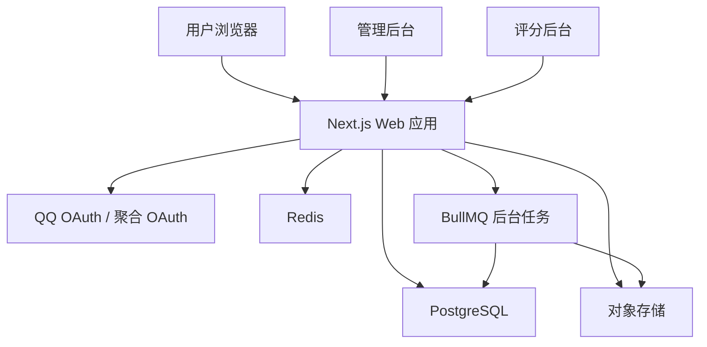
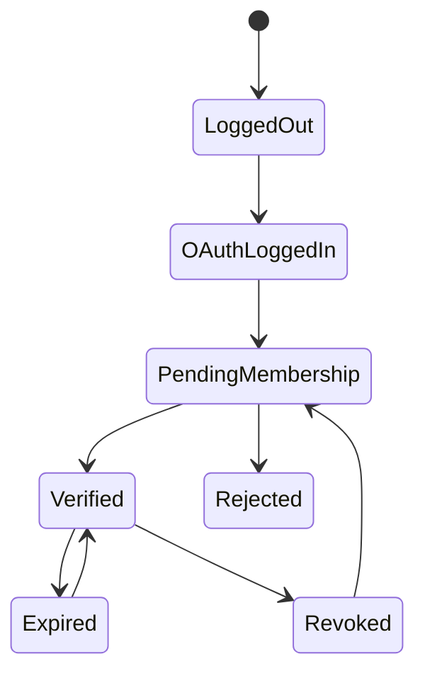
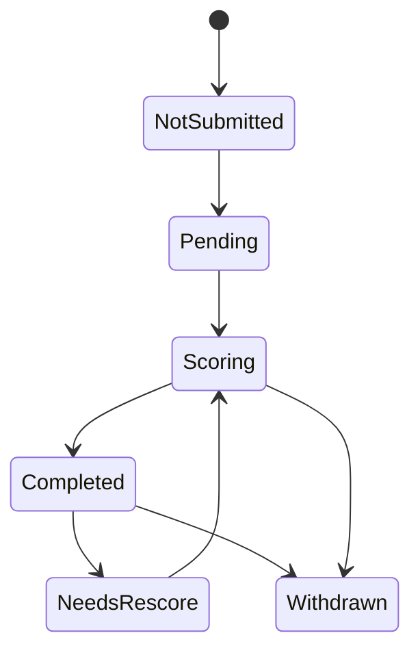
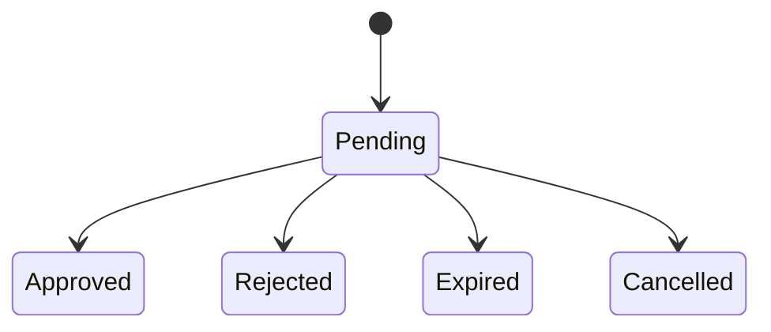

# 大数据匹配 Date 系统项目文档

版本：v0.1  
日期：2026-05-26  
面向对象：产品经理、程序员、设计师、测试、Vibe Coding 工具  
项目阶段：需求定义与 MVP 技术方案

## 1. 项目概述

本项目是一个面向 QQ 群成员的资料匹配 Web 系统。用户通过 QQ OAuth 登录并完成群成员认证后，可以填写个人资料与期待条件，系统根据双方资料与期待条件生成匹配结果。

系统分为两个独立匹配池：

1. 普通匹配池：不需要上传真实照片，不参与颜值评分。
2. 评分匹配池：需要上传本人真实照片，由评分组匿名评分后才能进入匹配。

两类用户不可同时参与两个匹配池。评分池与普通池完全隔离，互不匹配。

项目第一版重点是完成：

- QQ OAuth 登录。
- 群成员准入认证。
- 用户资料填写、修改、清空。
- 普通池匹配。
- 评分池资料提交、匿名评分、评分完成后匹配。
- 双向匹配与单项匹配分离展示。
- 单项匹配的信息查看申请。
- 管理后台、评分后台、举报与封禁。

## 2. 产品原则

### 2.1 核心原则

- 只有目标 QQ 群成员可以使用系统。
- 用户必须完成认证后才能提交资料和查看匹配。
- 用户提交资料前必须同意“匹配成功后资料可见”条款。
- 除照片外，双向匹配成功的用户可以互相查看所有资料。
- 照片只用于评分组匿名评分，不对普通用户展示。
- 普通匹配池与评分匹配池完全隔离。
- 单项匹配不能直接查看完整资料，必须申请授权。
- 双向匹配可以直接查看完整资料。
- 评分未完成的用户不能查看评分池匹配结果。
- 所有管理操作必须写入审计日志。

### 2.2 V1 不做的内容

- 不做复杂社交聊天系统。
- 不做站内动态、广场、评论区。
- 不做用户自定义颜值分上下限筛选。
- 不依赖非官方 QQ Bot 作为核心准入方式。
- 不公开展示用户上传的真实照片。
- 不允许未满 18 岁用户使用。

## 3. 角色与权限

### 3.1 普通用户

普通用户可以：

- 使用 QQ OAuth 登录。
- 进行群成员认证。
- 填写、修改、清空自己的资料。
- 选择普通匹配池或评分匹配池。
- 查看双向匹配结果。
- 查看单项匹配结果。
- 对单项匹配对象发起资料查看申请。
- 审批别人向自己发起的资料查看申请。
- 举报其他用户。
- 查看自己的警告、冻结或封禁状态。

普通用户不能：

- 查看他人照片。
- 查看未匹配用户完整资料。
- 查看评分组成员身份。
- 修改评分结果。
- 进入管理后台。

### 3.2 评分组

评分组成员可以：

- 进入评分后台。
- 查看待评分照片。
- 对照片进行匿名评分。
- 查看自己待完成评分任务数量。

评分组成员不能：

- 看到被评分用户的昵称、QQ 号、年龄、地址、属性、期待条件等信息。
- 看到其他评分组成员的单人评分。
- 修改已提交评分，除非超管开启重评。
- 查看普通用户完整资料。
- 处理举报、封禁、邀请码等管理动作。

### 3.3 普通管理

普通管理可以：

- 查看用户列表。
- 查看用户认证状态。
- 生成、作废邀请码。
- 审核群成员资格。
- 查看举报工单。
- 处理举报。
- 对用户警告、冻结资料、封禁。
- 查看基础审计日志。

普通管理不能：

- 修改系统核心配置。
- 管理超管账号。
- 查看评分组匿名评分明细，除非业务明确授权。
- 删除审计日志。

### 3.4 超管

超管可以：

- 管理全部用户。
- 管理角色与权限。
- 管理系统配置。
- 管理评分组成员。
- 重置评分任务。
- 处理严重违规。
- 查看完整审计日志。
- 配置 OAuth、存储、风控、邀请码策略。

## 4. 用户准入与认证方案

### 4.1 推荐 V1 方案

V1 推荐使用：

QQ OAuth 登录 + 管理员邀请码 + QQ 号绑定 + 周期复核

原因：

- 不强依赖 QQ Bot，降低封号和审核风险。
- 开发复杂度低，适合第一版快速上线。
- 管理员可以人工确认用户是否来自目标 QQ 群。
- 后续可以平滑升级到 QQ Bot 自动复核。

### 4.2 登录流程

1. 用户点击“QQ 登录”。
2. 系统跳转到 OAuth 授权页。
3. 用户授权后，系统获取第三方身份。
4. 系统保存 provider、openid、昵称、头像。
5. 新用户进入认证页。
6. 老用户根据认证状态进入资料页或匹配页。

### 4.3 OAuth 服务商说明

优先选择稳定、可维护、支持 OAuth2 标准流程的服务商。

候选方案：

1. QQ 互联官方 OAuth。
2. 聚合登录服务，例如小白聚合或其他 OAuth 聚合服务。
3. 自建认证网关，后续再接入多个 provider。

接入前必须确认：

- 是否能稳定返回唯一 openid。
- 是否能返回 QQ 昵称和头像。
- 是否支持回调地址配置。
- 是否支持生产环境域名。
- 是否允许当前业务场景使用。
- 是否有调用频率限制。
- 是否有数据留存和隐私政策。
- 是否支持授权撤销或账号解绑。

注意：OAuth 只能证明用户拥有某个 QQ 身份，不能证明该用户是目标 QQ 群成员。群成员资格必须通过额外认证实现。

### 4.4 群成员认证流程

推荐流程：

1. 用户登录后填写 QQ 号。
2. 用户向管理员申请邀请码。
3. 管理员确认该 QQ 号属于目标群成员。
4. 管理员在后台生成一次性邀请码。
5. 用户输入邀请码。
6. 系统绑定 OAuth 身份、QQ 号、邀请码与群成员认证状态。
7. 用户进入资料填写流程。

邀请码要求：

- 一次性使用。
- 有效期可配置，默认 24 小时。
- 只能绑定一个 QQ 号。
- 生成、使用、作废都要记录审计日志。
- 管理员可以备注对应群、申请来源、处理原因。

### 4.5 后续可升级方案

后续可以增加 QQ Bot 或群内验证码：

- Bot 向用户私聊或群内发送验证码。
- 用户在 Web 端输入验证码完成认证。
- Bot 监听退群事件，自动冻结或删除用户资料。
- 定期群内发布动态验证码，用户输入后延长认证有效期。

V1 不建议把 Bot 作为唯一准入方式。

### 4.6 认证状态

用户群成员认证状态：

- `pending`：待认证。
- `verified`：已认证。
- `expired`：认证过期，需要复核。
- `rejected`：认证被拒绝。
- `revoked`：管理员撤销认证。

认证过期策略：

- 默认每 30 天复核一次。
- 到期前 7 天提醒用户。
- 到期后用户不能查看匹配结果，但可以保留资料。
- 超过宽限期仍未复核，可以冻结资料。

## 5. 用户资料字段

### 5.1 基础资料

| 字段 | 类型 | 必填 | 说明 |
| --- | --- | --- | --- |
| 出生年月日 | date | 是 | 用于计算年龄，前端用滚动选择器 |
| 年龄 | computed | 是 | 根据出生年月日自动计算，不直接存储为主数据 |
| 身高 | integer | 是 | 单位 cm，范围 0-300 |
| 体重 | integer | 是 | 单位 kg，范围 0-200 |
| 所在地址 | province/city | 是 | 精确到市级 |
| 属性 | enum | 是 | `1`、`0`、`偏1`、`偏0`、`side`、`其他` |
| QQ 号 | string | 是 | 登录后用户填写，认证时绑定 |
| 自我介绍 | text | 否 | 可选，限制长度 |
| 资料同意条款 | boolean | 是 | 必须勾选才能提交 |

### 5.2 期待条件

| 字段 | 类型 | 必填 | 说明 |
| --- | --- | --- | --- |
| 期待年龄下限 | integer | 是 | 最低 18 |
| 期待年龄上限 | integer | 是 | 最高 100 |
| 期待身高下限 | integer | 是 | 最低 0，单位 cm |
| 期待身高上限 | integer | 是 | 最高 300，单位 cm |
| 期待体重下限 | integer | 是 | 最低 0，单位 kg |
| 期待体重上限 | integer | 是 | 最高 200，单位 kg |
| 期待所在地 | province/city/scope | 是 | 可选择城市、全省、不限 |
| 期待属性 | enum[] | 是 | 可多选 |

身高与体重范围展示格式：

- `170cm - 185cm`
- `50kg - 75kg`

这里使用普通范围连字符，前后保留空格，避免视觉拥挤。

### 5.3 评分池字段

| 字段 | 类型 | 必填 | 说明 |
| --- | --- | --- | --- |
| 是否参与评分池 | boolean | 是 | 与普通池互斥 |
| 真实照片 | image | 条件必填 | 参与评分池必须上传 |
| 评分状态 | enum | 条件必填 | 未提交、待评分、评分中、已完成、需重评 |
| 最终颜值分 | decimal | 条件必填 | 评分完成后生成 |
| 7 分线偏好 | enum | 条件必填 | 仅评分完成且分数 >= 7 时生效 |

7 分线偏好：

- `不限`：可以匹配 7 分以下用户。
- `仅 7 分及以上`：不匹配 7 分以下用户。

该设置只在用户自己的最终评分 `>= 7` 时生效。

### 5.4 字段校验

基础校验：

- 用户年龄必须 >= 18。
- 期待年龄下限必须 >= 18。
- 期待年龄上限必须 <= 100。
- 下限不能大于上限。
- QQ 号必须为数字字符串。
- 所在地必须来自标准省市数据。
- 属性必须来自枚举。
- 期待属性至少选择一项。
- 上传图片必须限制类型、大小、尺寸和安全扫描。

## 6. 资料可见性规则

### 6.1 普通资料

双向匹配成功后，双方可以互相查看除照片外的所有资料。

可见资料包括：

- QQ 头像。
- QQ 昵称。
- QQ 号。
- 年龄。
- 身高。
- 体重。
- 所在地。
- 属性。
- 期待条件。
- 自我介绍。
- 评分池最终分数，如果双方都在评分池且评分已完成。

### 6.2 照片

照片规则：

- 只用于评分组匿名评分。
- 不展示给普通用户。
- 不展示在排行榜。
- 不展示在匹配详情。
- 用户退出评分池时，应允许删除或停用照片。
- 管理后台默认不直接公开浏览照片，只有必要权限可以访问。

### 6.3 提交前确认条款

用户提交资料前必须勾选：

我确认我已年满 18 岁，并同意在系统判定为双向匹配或我授权单项匹配查看后，对方可以查看我提交的除照片外的完整资料。

未勾选时不能提交。

## 7. 匹配系统

### 7.1 匹配池

系统存在两个独立池：

- `normal_pool`：普通匹配池。
- `rated_pool`：评分匹配池。

匹配池规则：

- 普通池只匹配普通池。
- 评分池只匹配评分池。
- 用户不能同时在两个池。
- 用户从普通池切到评分池，需要上传照片并等待评分完成。
- 用户从评分池切到普通池，需要退出评分池，照片与评分数据按产品策略隐藏、停用或删除。

### 7.2 双向匹配

双向匹配定义：

用户 A 满足用户 B 的期待条件，同时用户 B 也满足用户 A 的期待条件。

双向匹配命中后：

- 出现在“双向匹配”页面。
- 可以直接查看对方完整资料，照片除外。
- 系统记录一次匹配关系。
- 双方都可以举报对方。

### 7.3 单项匹配

单项匹配定义：

只满足一个方向的期待条件。

常见情况：

- B 满足 A 的期待，但 A 不满足 B 的期待。
- A 满足 B 的期待，但 B 不满足 A 的期待。

单项匹配页面规则：

- 不直接展示完整资料。
- 展示脱敏摘要。
- 用户可以发起查看资料申请。
- 对方同意后才可查看除照片外的完整资料。
- 对方拒绝后，一段冷却期内不能重复申请，默认 7 天。

单项匹配脱敏摘要建议：

- 年龄区间，例如 `24-26`。
- 所在地范围，例如 `广东省内`。
- 身高区间，例如 `170-175cm`。
- 属性。
- 是否评分池。
- 评分池用户可显示 `7 分及以上` 或分数区间，是否显示精确分后续可配置。

### 7.4 匹配条件

用户 A 是否接受用户 B，需要同时满足：

- B 年龄在 A 期待年龄范围内。
- B 身高在 A 期待身高范围内。
- B 体重在 A 期待体重范围内。
- B 所在地符合 A 期待所在地规则。
- B 属性在 A 期待属性列表内。
- B 与 A 在同一个匹配池。
- B 账号状态正常。
- B 资料状态正常。
- 如果是评分池，B 评分已完成。
- 如果是评分池，满足 7 分线规则。

### 7.5 所在地匹配规则

用户期待所在地可以支持：

- 指定城市。
- 指定省份内所有城市。
- 不限地区。

判断逻辑：

- 期待为城市：候选人的城市必须相同。
- 期待为全省：候选人的省份必须相同。
- 期待为不限：不限制。

### 7.6 属性匹配规则

属性枚举：

- `1`
- `0`
- `偏1`
- `偏0`
- `side`
- `其他`

V1 建议采用用户显式选择，不做系统默认兼容推断。

例如：

- 用户期待属性选择 `0` 和 `偏0`，则只有这两类候选人满足。
- 如果用户愿意接受 `其他`，必须手动勾选 `其他`。

这样规则简单透明，避免系统自作主张。

### 7.7 评分池 7 分线规则

系统只设置一个颜值分界线：7 分。

用户不能自行选择颜值分上限或下限。

规则：

- 分数 `< 7` 的用户：正常参与评分池匹配。
- 分数 `>= 7` 的用户：可以选择是否只匹配 7 分及以上用户。
- 当用户选择“仅 7 分及以上”时，候选人的最终颜值分必须 `>= 7`。
- 当用户选择“不限”时，不限制候选人颜值分。
- 单项匹配也必须遵守该规则，不能绕过限制。
- 评分未完成的用户不能进入评分池匹配结果。

前端文案建议：

- 字段名：`评分匹配范围`
- 选项 1：`不限`
- 选项 2：`仅 7 分及以上`

### 7.8 匹配排序

V1 可以先用规则排序，不做复杂机器学习。

排序建议：

1. 双向匹配优先于单项匹配。
2. 同城优先。
3. 同省优先。
4. 年龄更接近期望范围中心的优先。
5. 身高更接近期望范围中心的优先。
6. 体重更接近期望范围中心的优先。
7. 资料完整度高的优先。
8. 最近活跃用户优先。

评分池可以增加：

- 双方是否都满足 7 分线偏好。
- 分数是否同区间。

不要在 V1 做黑箱推荐。用户应该能理解为什么一个人出现在结果里。

### 7.9 匹配结果状态

匹配关系状态：

- `candidate`：候选。
- `mutual_match`：双向匹配。
- `one_way_match`：单项匹配。
- `view_requested`：已申请查看。
- `view_approved`：对方已同意查看。
- `view_rejected`：对方已拒绝查看。
- `blocked`：因封禁、举报或拉黑不可见。

## 8. 评分系统

### 8.1 评分流程

1. 用户选择参与评分池。
2. 用户上传本人真实照片。
3. 系统创建评分任务。
4. 所有评分组成员收到待评分任务。
5. 评分组成员只能看到照片，看不到任何用户信息。
6. 每名评分组成员提交评分。
7. 所有评分组成员完成评分后，系统计算最终分。
8. 去掉一个最高分，去掉一个最低分，取平均值。
9. 用户可以查看自己的分数。
10. 用户开始进入评分池匹配。

### 8.2 评分状态

评分状态：

- `not_submitted`：未提交照片。
- `pending`：已提交，等待进入评分。
- `scoring`：评分中。
- `completed`：评分完成。
- `needs_rescore`：需要重评。
- `withdrawn`：用户退出评分池。

用户在 `pending` 或 `scoring` 状态查看匹配时，前端显示：

评分中，请耐心等待

### 8.3 评分规则

评分范围建议：

- 1 到 10 分。
- 支持一位小数，或只允许整数。V1 建议整数，减少评分压力。

最终分计算：

- 评分人数必须等于当前有效评分组成员数量。
- 如果评分组成员数 >= 3，去掉最高分和最低分后取平均。
- 如果业务要求评分组固定不少于 3 人，则系统应限制评分组人数不能低于 3。
- 如果评分组成员变动，已有任务以创建任务时的评分组快照为准。

重要规则：

- 不存在“样本不足”展示。
- 用户必须等所有评分组成员完成评分后才能看到分数。
- 用户必须等评分完成后才能查看评分池匹配结果。

### 8.4 匿名性

评分匿名要求：

- 评分组只看到照片。
- 评分组看不到用户 ID、昵称、QQ 号、所在地、年龄、属性。
- 评分任务 ID 不能暴露可反查用户的信息。
- 单个评分人的分数不对用户展示。
- 用户只看到最终分。

### 8.5 排行榜

评分池可以生成排行榜。

排行榜展示：

- QQ 头像。
- QQ 昵称。
- QQ 号，建议可脱敏显示。
- 最终颜值分。

排行榜不展示：

- 上传照片。
- 单个评分人的评分。
- 详细期待条件。
- 体重等敏感字段，除非产品明确需要。

排行榜是否进入 V1 可由开发排期决定。建议 V1.1 再上。

## 9. 页面与功能模块

### 9.1 用户端页面

#### 9.1.1 登录页

功能：

- QQ OAuth 登录入口。
- 展示系统使用前提：仅限目标 QQ 群认证成员。
- 展示基本隐私说明。

#### 9.1.2 认证页

功能：

- 填写 QQ 号。
- 输入邀请码。
- 查看认证状态。
- 查看认证过期时间。
- 认证失败时展示原因。

#### 9.1.3 资料编辑页

功能：

- 填写基础资料。
- 填写期待条件。
- 选择普通池或评分池。
- 如果选择评分池，上传照片。
- 勾选资料可见性同意条款。
- 保存草稿。
- 提交资料。

交互要求：

- 出生年月日使用滚动选择。
- 身高使用滚动选择。
- 体重使用滚动选择。
- 年龄范围使用滚动选择。
- 身高范围、体重范围使用前后两个选择控件。
- 所在地使用省市选择器。
- 属性和期待属性使用明确选项。

#### 9.1.4 我的资料页

功能：

- 查看自己的资料。
- 修改资料。
- 查看评分状态和分数。
- 切换匹配池。
- 清空资料。

清空资料要求：

- 必须二次强确认。
- 用户必须输入指定确认文本，例如：`确认清空我的资料`。
- 清空后保留账号、认证、违规记录、审计记录。
- 清空后用户不再出现在匹配结果中。

#### 9.1.5 匹配结果页

顶部提供两个入口：

- 双向匹配。
- 单项匹配。

评分池用户如果评分未完成，显示：

评分中，请耐心等待

#### 9.1.6 双向匹配页

功能：

- 展示所有双向匹配对象。
- 可以直接查看对方完整资料，照片除外。
- 可以举报。
- 可以隐藏该匹配对象。

#### 9.1.7 单项匹配页

功能：

- 展示单项匹配对象的脱敏摘要。
- 发起查看资料申请。
- 查看申请状态。
- 收到申请时进行同意或拒绝。

申请状态：

- `pending`：待处理。
- `approved`：已同意。
- `rejected`：已拒绝。
- `expired`：已过期。
- `cancelled`：用户取消。

#### 9.1.8 举报页

功能：

- 对用户发起举报。
- 选择举报类型。
- 填写举报说明。
- 上传证据截图。
- 查看处理状态。

举报类型建议：

- 资料虚假。
- 冒用照片。
- 非本人信息。
- 骚扰。
- 诈骗或引流。
- 恶意举报。
- 其他。

### 9.2 管理后台页面

#### 9.2.1 管理首页

展示：

- 用户总数。
- 已认证用户数。
- 待认证数量。
- 评分中数量。
- 举报待处理数量。
- 今日新增用户。
- 今日匹配数量。

#### 9.2.2 用户管理

功能：

- 搜索用户。
- 按 QQ 号、昵称、状态、匹配池筛选。
- 查看用户资料。
- 查看认证状态。
- 查看举报记录。
- 警告、冻结、封禁、解封。
- 清空违规资料。

#### 9.2.3 邀请码管理

功能：

- 生成邀请码。
- 指定 QQ 号。
- 设置有效期。
- 作废邀请码。
- 查看使用状态。
- 查看生成管理员。

#### 9.2.4 群成员认证管理

功能：

- 查看待认证申请。
- 通过认证。
- 拒绝认证。
- 撤销认证。
- 批量设置认证过期。
- 记录处理备注。

#### 9.2.5 举报管理

功能：

- 查看举报列表。
- 查看举报详情。
- 标记处理中。
- 判定成立或不成立。
- 对被举报用户执行警告、冻结、封禁。
- 对恶意举报者处理。

#### 9.2.6 评分管理

超管可用：

- 管理评分组成员。
- 查看评分任务状态。
- 触发重评。
- 查看评分完成率。

普通管理默认不可查看照片和评分明细。

#### 9.2.7 审计日志

记录：

- 登录。
- 邀请码生成、使用、作废。
- 认证通过、拒绝、撤销。
- 用户资料修改。
- 用户清空资料。
- 评分任务创建、完成、重评。
- 举报处理。
- 警告、冻结、封禁、解封。
- 权限变更。
- 系统配置修改。

## 10. 技术栈建议

### 10.1 推荐技术栈

MVP 推荐：

- 前端框架：Next.js 15 + React + TypeScript。
- UI：Tailwind CSS + shadcn/ui，或 Ant Design。
- 后端：Next.js Route Handlers / Server Actions。
- 数据库：PostgreSQL。
- ORM：Prisma。
- 缓存与任务：Redis + BullMQ。
- 对象存储：S3 兼容存储、阿里云 OSS、腾讯云 COS 或本地 MinIO。
- 登录：OAuth2 Authorization Code Flow。
- 表单校验：Zod。
- 权限控制：RBAC。
- 文件安全：图片类型校验、大小限制、私有桶、签名 URL。
- 部署：Docker Compose 起步，后续迁移到云服务器或容器平台。
- 日志：Pino 或 Winston。
- 错误监控：Sentry，可后续接入。

### 10.2 为什么推荐 Next.js 全栈

适合本项目的原因：

- 页面多，但业务逻辑不复杂。
- 需要快速迭代产品规则。
- Vibe Coding 生成页面、表单、后台 CRUD 效率高。
- TypeScript 可以同时覆盖前后端类型。
- 可以先做单体应用，后续再拆服务。

### 10.3 可替代方案

如果团队偏后端工程化：

- 前端：Vue 3 + Vite + Element Plus。
- 后端：NestJS。
- 数据库：PostgreSQL。
- ORM：Prisma 或 TypeORM。

如果团队偏 Java：

- 前端：React/Vue。
- 后端：Spring Boot。
- 数据库：PostgreSQL 或 MySQL。
- ORM：MyBatis Plus。

MVP 不建议一开始做微服务。

## 11. 系统架构

### 11.1 架构图



### 11.2 模块划分

核心模块：

- Auth：登录、OAuth 回调、Session。
- Membership：群成员认证、邀请码、认证过期。
- Profile：用户资料、期待条件、资料状态。
- Matching：匹配计算、双向匹配、单项匹配。
- Rating：照片上传、评分任务、最终分计算。
- Requests：单项匹配查看申请。
- Reports：举报、处理、处罚。
- Admin：后台管理。
- RBAC：角色权限。
- Audit：审计日志。
- Storage：私有照片存储和访问控制。

## 12. 数据模型建议

### 12.1 User

用户主表。

字段：

- `id`
- `created_at`
- `updated_at`
- `status`：active、frozen、banned、deleted
- `role`：user、scorer、admin、super_admin
- `last_login_at`

### 12.2 AuthIdentity

OAuth 身份表。

字段：

- `id`
- `user_id`
- `provider`
- `provider_user_id`
- `openid`
- `unionid`
- `nickname`
- `avatar_url`
- `access_token_encrypted`
- `refresh_token_encrypted`
- `created_at`
- `updated_at`

唯一索引：

- `provider + openid`

### 12.3 GroupMembership

群成员认证表。

字段：

- `id`
- `user_id`
- `qq_number`
- `group_id`
- `status`
- `verified_at`
- `expires_at`
- `verified_by`
- `revoked_at`
- `revoked_by`
- `remark`

### 12.4 InviteCode

邀请码表。

字段：

- `id`
- `code_hash`
- `qq_number`
- `status`：unused、used、expired、revoked
- `expires_at`
- `created_by`
- `used_by`
- `used_at`
- `remark`

注意：邀请码不要明文存储，建议存 hash。

### 12.5 Profile

用户资料表。

字段：

- `id`
- `user_id`
- `pool_type`：normal、rated
- `birth_date`
- `height_cm`
- `weight_kg`
- `province_code`
- `city_code`
- `attribute`
- `self_intro`
- `consent_profile_visibility`
- `status`：draft、active、hidden、cleared、frozen
- `created_at`
- `updated_at`

### 12.6 Preference

期待条件表。

字段：

- `id`
- `user_id`
- `age_min`
- `age_max`
- `height_min_cm`
- `height_max_cm`
- `weight_min_kg`
- `weight_max_kg`
- `location_scope`：city、province、any
- `expected_province_code`
- `expected_city_code`
- `expected_attributes`
- `created_at`
- `updated_at`

`expected_attributes` 可以用 JSONB 或关联表。

### 12.7 RatingProfile

评分池扩展表。

字段：

- `id`
- `user_id`
- `photo_object_key`
- `photo_status`
- `rating_status`
- `final_score`
- `score_completed_at`
- `score_threshold_preference`：any、gte_7
- `created_at`
- `updated_at`

### 12.8 RatingTask

评分任务表。

字段：

- `id`
- `rated_user_id`
- `photo_object_key`
- `status`
- `scorer_snapshot`
- `created_at`
- `completed_at`

`scorer_snapshot` 保存创建任务时应参与评分的评分组成员 ID 列表，避免评分组变动影响旧任务。

### 12.9 RatingScore

单个评分记录。

字段：

- `id`
- `rating_task_id`
- `scorer_user_id`
- `score`
- `created_at`

唯一索引：

- `rating_task_id + scorer_user_id`

### 12.10 MatchSnapshot

匹配快照表，可选。

字段：

- `id`
- `user_id`
- `target_user_id`
- `match_type`：mutual、one_way
- `direction`：i_like_target、target_likes_me、mutual
- `score`
- `computed_at`

MVP 可以实时计算，用户量上来后再落快照。

### 12.11 ViewRequest

单项匹配查看申请表。

字段：

- `id`
- `requester_id`
- `target_user_id`
- `status`：pending、approved、rejected、expired、cancelled
- `message`
- `created_at`
- `responded_at`
- `expires_at`

唯一策略：

- 同一 requester 对同一 target 同时只能有一个 pending 请求。
- rejected 后进入冷却期。

### 12.12 Report

举报表。

字段：

- `id`
- `reporter_id`
- `target_user_id`
- `type`
- `description`
- `evidence_object_keys`
- `status`：pending、reviewing、accepted、rejected
- `handled_by`
- `handled_at`
- `resolution`
- `created_at`

### 12.13 Penalty

处罚记录表。

字段：

- `id`
- `user_id`
- `type`：warning、profile_frozen、account_banned
- `reason`
- `created_by`
- `created_at`
- `expires_at`
- `revoked_at`

### 12.14 AuditLog

审计日志表。

字段：

- `id`
- `actor_user_id`
- `action`
- `target_type`
- `target_id`
- `metadata`
- `ip`
- `user_agent`
- `created_at`

## 13. API 设计建议

### 13.1 Auth

- `GET /api/auth/qq/start`
- `GET /api/auth/qq/callback`
- `POST /api/auth/logout`
- `GET /api/auth/me`

### 13.2 Membership

- `GET /api/membership/status`
- `POST /api/membership/submit-code`
- `POST /api/admin/invite-codes`
- `GET /api/admin/invite-codes`
- `POST /api/admin/memberships/:id/approve`
- `POST /api/admin/memberships/:id/reject`
- `POST /api/admin/memberships/:id/revoke`

### 13.3 Profile

- `GET /api/profile/me`
- `PUT /api/profile/me`
- `POST /api/profile/clear`
- `POST /api/profile/switch-pool`

### 13.4 Rating

- `POST /api/rating/photo`
- `GET /api/rating/status`
- `GET /api/scorer/tasks`
- `POST /api/scorer/tasks/:id/score`
- `GET /api/admin/rating/tasks`
- `POST /api/admin/rating/tasks/:id/rescore`

### 13.5 Matching

- `GET /api/matches/mutual`
- `GET /api/matches/one-way`
- `GET /api/matches/:userId`

### 13.6 View Requests

- `POST /api/view-requests`
- `GET /api/view-requests/incoming`
- `GET /api/view-requests/outgoing`
- `POST /api/view-requests/:id/approve`
- `POST /api/view-requests/:id/reject`

### 13.7 Reports

- `POST /api/reports`
- `GET /api/reports/me`
- `GET /api/admin/reports`
- `POST /api/admin/reports/:id/resolve`

### 13.8 Admin Users

- `GET /api/admin/users`
- `GET /api/admin/users/:id`
- `POST /api/admin/users/:id/warn`
- `POST /api/admin/users/:id/freeze`
- `POST /api/admin/users/:id/ban`
- `POST /api/admin/users/:id/unban`

## 14. 匹配算法伪代码

### 14.1 判断 A 是否接受 B

```ts
function accepts(a: UserWithProfile, b: UserWithProfile): boolean {
  if (a.id === b.id) return false;
  if (!isUserActive(a) || !isUserActive(b)) return false;
  if (!isProfileActive(a) || !isProfileActive(b)) return false;
  if (a.profile.poolType !== b.profile.poolType) return false;

  if (a.profile.poolType === "rated") {
    if (!isRatingCompleted(a) || !isRatingCompleted(b)) return false;
    if (!passesScoreThreshold(a, b)) return false;
  }

  const bAge = calculateAge(b.profile.birthDate);
  if (bAge < a.preference.ageMin || bAge > a.preference.ageMax) return false;
  if (b.profile.heightCm < a.preference.heightMinCm) return false;
  if (b.profile.heightCm > a.preference.heightMaxCm) return false;
  if (b.profile.weightKg < a.preference.weightMinKg) return false;
  if (b.profile.weightKg > a.preference.weightMaxKg) return false;
  if (!matchesLocation(a.preference, b.profile)) return false;
  if (!a.preference.expectedAttributes.includes(b.profile.attribute)) return false;

  return true;
}
```

### 14.2 7 分线判断

```ts
function passesScoreThreshold(a: UserWithRating, b: UserWithRating): boolean {
  if (a.rating.finalScore < 7) return true;
  if (a.rating.scoreThresholdPreference === "any") return true;
  return b.rating.finalScore >= 7;
}
```

### 14.3 匹配类型

```ts
function getMatchType(a: UserWithProfile, b: UserWithProfile) {
  const aAcceptsB = accepts(a, b);
  const bAcceptsA = accepts(b, a);

  if (aAcceptsB && bAcceptsA) return "mutual";
  if (aAcceptsB || bAcceptsA) return "one_way";
  return "none";
}
```

### 14.4 最终分计算

```ts
function calculateFinalScore(scores: number[]): number {
  if (scores.length < 3) {
    throw new Error("评分组人数不能少于 3");
  }

  const sorted = [...scores].sort((a, b) => a - b);
  const trimmed = sorted.slice(1, sorted.length - 1);
  const sum = trimmed.reduce((total, score) => total + score, 0);

  return roundToOneDecimal(sum / trimmed.length);
}
```

## 15. 状态流

### 15.1 用户准入状态流



### 15.2 评分状态流



### 15.3 单项查看申请状态流



## 16. 安全与隐私

### 16.1 账号安全

- 使用安全 Session。
- Cookie 设置 HttpOnly、Secure、SameSite。
- 后台操作必须校验 RBAC 权限。
- 管理员操作建议增加二次确认。
- 登录回调必须校验 state，防 CSRF。
- OAuth 建议使用 Authorization Code Flow。

### 16.2 文件安全

- 照片存储在私有桶。
- 不使用公开 URL。
- 评分后台通过短期签名 URL 访问图片。
- 限制图片格式，例如 jpg、png、webp。
- 限制图片大小。
- 上传后生成安全文件名，不使用原文件名。
- 可接入图片内容安全扫描。

### 16.3 数据隐私

- QQ 号、照片、体重、所在地属于敏感程度较高的信息。
- 后台按最小权限展示。
- 审计日志记录管理端查看敏感资料的行为。
- 用户清空资料后，不再参与匹配。
- 被封禁用户资料默认不再对外展示。

### 16.4 风控

建议增加：

- 邀请码提交频率限制。
- 登录频率限制。
- 单项申请频率限制。
- 举报频率限制。
- 图片上传频率限制。
- 管理员危险操作二次确认。

### 16.5 合规提示

本系统涉及成年人社交、真实照片、QQ 号、地理位置、评分等敏感内容。上线前应根据实际运营地区、服务器所在地、用户范围和数据处理方式进行合规评估，并准备用户协议、隐私政策、删除机制和申诉机制。

## 17. 前端体验要求

### 17.1 设计风格

建议风格：

- 清爽、克制、偏工具型。
- 不做过度娱乐化视觉。
- 匹配结果以信息扫描效率为主。
- 管理后台以表格、筛选、状态标签为主。

### 17.2 移动端优先

用户大概率从 QQ 群和手机浏览器进入，因此用户端需要移动端优先。

要求：

- 表单控件适合手机输入。
- 出生年月日、身高、体重使用滚动选择。
- 匹配卡片在手机上可快速浏览。
- 管理后台可以桌面优先。

### 17.3 关键文案

评分中：

评分中，请耐心等待

清空资料确认：

确认清空我的资料

评分匹配范围：

- 不限
- 仅 7 分及以上

资料可见性同意：

我确认我已年满 18 岁，并同意在系统判定为双向匹配或我授权单项匹配查看后，对方可以查看我提交的除照片外的完整资料。

## 18. 后台任务

建议异步任务：

- 认证过期提醒。
- 过期认证状态刷新。
- 评分任务完成检测。
- 最终分计算。
- 匹配快照刷新。
- 图片安全扫描。
- 审计日志归档。

MVP 可以先实时计算匹配，后台任务只做评分完成检测和认证过期。

## 19. 测试清单

### 19.1 用户认证

- 新用户未认证不能提交资料。
- 邀请码只能使用一次。
- 邀请码过期后不能使用。
- QQ 号与邀请码绑定不一致时不能认证。
- 认证过期后不能查看匹配结果。

### 19.2 资料

- 未满 18 岁不能提交。
- 范围下限大于上限时报错。
- 未勾选资料可见性条款不能提交。
- 清空资料需要输入确认文本。
- 清空后不再出现在匹配结果中。

### 19.3 匹配

- 普通池不匹配评分池。
- 评分未完成不展示评分池匹配。
- 双向匹配直接展示完整资料。
- 单项匹配只展示脱敏摘要。
- 单项申请通过后才展示完整资料。
- 7 分线规则对双向和单项都生效。

### 19.4 评分

- 评分组成员看不到用户信息。
- 所有评分组成员完成评分前不生成最终分。
- 最终分去掉最高分和最低分。
- 用户退出评分池后不再进入评分池匹配。

### 19.5 管理

- 普通管理不能修改超管。
- 评分组不能进入普通管理后台。
- 警告、冻结、封禁都写入审计日志。
- 举报处理后状态正确更新。

## 20. MVP 迭代计划

### 20.1 Milestone 1：基础账号与认证

- 初始化项目。
- OAuth 登录。
- 用户表与身份表。
- 管理员邀请码。
- 群成员认证。
- 基础 RBAC。

### 20.2 Milestone 2：资料系统

- 用户资料表单。
- 期待条件表单。
- 资料校验。
- 资料清空。
- 资料可见性同意。

### 20.3 Milestone 3：普通匹配池

- 双向匹配计算。
- 单项匹配计算。
- 双向匹配页面。
- 单项匹配页面。
- 查看申请流程。

### 20.4 Milestone 4：评分池

- 照片上传。
- 评分任务。
- 评分后台。
- 最终分计算。
- 7 分线规则。
- 评分池匹配。

### 20.5 Milestone 5：管理与风控

- 用户管理。
- 举报管理。
- 警告、冻结、封禁。
- 审计日志。
- 认证过期复核。

### 20.6 Milestone 6：优化

- 排行榜。
- 批量管理。
- 匹配快照。
- 通知提醒。
- QQ Bot 或群验证码复核。

## 21. Vibe Coding 提示词建议

### 21.1 初始化项目提示词

```text
请创建一个 Next.js 15 + TypeScript + Tailwind CSS + Prisma + PostgreSQL 的全栈项目。
项目是一个 QQ 群成员专用的资料匹配系统。
请先实现用户模型、OAuth 身份模型、群成员认证模型、资料模型、期待条件模型和基础 RBAC。
所有表单校验使用 Zod。
后台使用清爽的管理系统布局。
用户端移动优先。
```

### 21.2 资料表单提示词

```text
请实现用户资料编辑页。
字段包括出生年月日、身高、体重、所在地、属性、期待年龄范围、期待身高范围、期待体重范围、期待所在地、期待属性、匹配池选择。
提交前必须勾选资料可见性同意条款。
未满 18 岁不能提交。
范围下限不能大于上限。
```

### 21.3 匹配算法提示词

```text
请实现匹配算法。
普通池和评分池完全隔离。
双向匹配定义为双方都满足对方期待条件。
单项匹配定义为只有一个方向满足。
评分池用户必须评分完成才能进入匹配。
评分池只允许一个 7 分界限：当用户分数 >= 7 且选择“仅 7 分及以上”时，候选人分数必须 >= 7。
```

### 21.4 评分后台提示词

```text
请实现评分组后台。
评分组成员只能看到待评分照片，不能看到用户昵称、QQ 号、年龄、地区、属性或任何资料。
所有评分组成员完成评分后，系统去掉一个最高分、去掉一个最低分并计算平均分。
评分完成前用户查看匹配结果时显示“评分中，请耐心等待”。
```

### 21.5 管理后台提示词

```text
请实现管理后台。
包括用户管理、邀请码管理、群成员认证管理、举报管理、处罚管理和审计日志。
普通管理可以处理邀请码、认证、举报和用户处罚。
超管可以管理角色、评分组和系统配置。
所有管理动作必须写入审计日志。
```

## 22. 开发约定

### 22.1 命名建议

- 用户：`User`
- OAuth 身份：`AuthIdentity`
- 群成员资格：`GroupMembership`
- 邀请码：`InviteCode`
- 资料：`Profile`
- 期待条件：`Preference`
- 评分资料：`RatingProfile`
- 评分任务：`RatingTask`
- 评分记录：`RatingScore`
- 匹配快照：`MatchSnapshot`
- 查看申请：`ViewRequest`
- 举报：`Report`
- 处罚：`Penalty`
- 审计日志：`AuditLog`

### 22.2 权限判断

任何接口都必须先判断：

1. 是否登录。
2. 用户状态是否正常。
3. 是否完成群成员认证。
4. 当前角色是否有权限访问该资源。
5. 对目标资源是否有可见性权限。

### 22.3 错误返回

建议统一错误格式：

```json
{
  "error": {
    "code": "PROFILE_NOT_VERIFIED",
    "message": "请先完成群成员认证"
  }
}
```

### 22.4 审计日志

任何改变用户状态、认证状态、评分状态、权限状态、资料可见性的操作都必须记录审计日志。

## 23. 关键未决问题

以下问题需要在开发前或开发中确认：

1. OAuth 服务商最终选择 QQ 互联官方，还是聚合 OAuth 服务。
2. 是否只支持一个 QQ 群，还是支持多个群。
3. QQ 号在排行榜中是否完整展示，还是脱敏展示。
4. 评分分数是否显示一位小数，还是整数。
5. 排行榜是否进入 V1，还是放到 V1.1。
6. 用户退出评分池后，照片是立即删除、软删除，还是保留一段时间。
7. 单项匹配申请通过后，是申请方可见，还是双方互相可见。
8. 管理员是否可以代表用户清空资料。

## 24. 推荐 V1 决策

为了尽快上线，建议 V1 固定如下决策：

- 只支持一个 QQ 群。
- 使用管理员邀请码完成群成员认证。
- 认证有效期 30 天。
- 普通池和评分池完全隔离。
- 评分组至少 3 人。
- 评分采用整数 1-10 分。
- 最终分保留一位小数。
- 只设置 7 分线，不允许用户自定义分数上下限。
- 双向匹配直接展示完整资料，照片除外。
- 单项匹配申请通过后双方互相可见。
- 排行榜放到 V1.1。
- QQ 号在用户详情中完整显示，在排行榜中默认脱敏。

